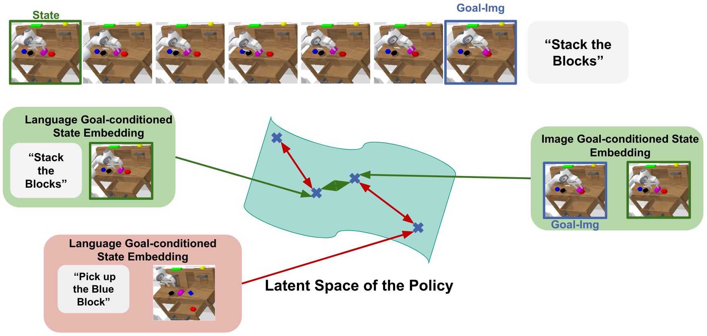
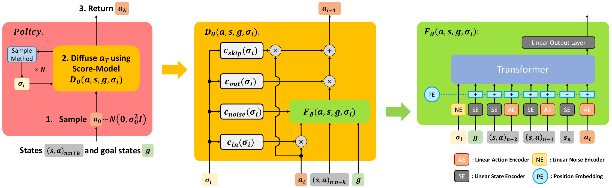
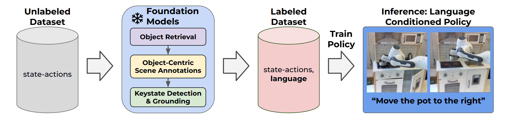

<!-- Using HTML to center the abstract
<video width="100%" autoplay controls muted loop playsinline>
    <source src="./static/videos/mdt-v5-encoded.mp4" type="video/mp4">
</video> -->

<div class="columns is-centered has-text-centered">
    <div class="column is-four-fifths">
        <h2>Abstract</h2>
        <div class="content has-text-justified">
This work introduces the Multimodal Diffusion
Transformer (MDT), a novel diffusion policy framework, that
excels at learning versatile behavior from multimodal goal specifi-
cations with few language annotations. MDT leverages a diffusion
based multimodal transformer backbone and two self-supervised
auxiliary objectives to master long-horizon manipulation tasks
based on multimodal goals. The vast majority of imitation
learning methods only learn from individual goal modalities,
e.g. either language or goal images. However, existing large-
scale imitation learning datasets are only partially labeled with
language annotations, which prohibits current methods from
learning language conditioned behavior from these datasets.
MDT addresses this challenge by introducing a latent goal-
conditioned state representation, that is simultaneously trained
on multimodal goal instructions. This state representation aligns
image and language based goal embeddings and encodes suffi-
cient information to predict future states. The representation is
trained via two self-supervised auxiliary objectives that enhance
the performance of the presented transformer backbone. MDT
shows exceptional performance on 164 tasks provided by the chal-
lenging CALVIN and LIBERO benchmarks, including a LIBERO
version that contains less than 2% language annotations. Further,
MDT establishes a new record on the CALVIN manipulation
challenge, demonstrating an absolute performance improvement
of 15% over prior state-of-the-art methods, that require large-
scale pretraining and contain 10× more learnable parameters.
MDT demonstrated its ability to solve long-horizon manipulation
from sparsely annotated data in both simulated and real-world
environments.
        </div>
    </div>
</div>

---

<!-- > Note: This is an example of a Jekyll-based project website template: [Github link](https://github.com/shunzh/project_website).\
> The following content is generated by ChatGPT. The figure is manually added. -->

## Model Architecture

**Left**: Overview of the proposed multimodal Transformer-Encoder-Decoder Diffusion Policy used in MDT.
**Right**: Specialized Diffusion Transformer Block for the Denoising of the Action Sequence.

MDT learns a goal-conditioned latent state representation from multiple image observations
and multimodal goals. The camera images are either processed with frozen Voltron Encoders
and a Perceiver or using ResNets. The separate GPT denoising module iteratively denoises an
action sequence of 10 steps with a Transformer Decoder with causal Attention. It consists of
several Denoising Blocks, as visualized on the right side. These blocks process noisy action
tokens with self-attention and fuse the conditioning information from the latent state
representation via cross-attention. MDT applies adaLN conditioning to condition the blocks
on the current noise level. In addition, it aligns the latent representation tokens of the same
state with different goal specifications using self-supervised contrastive learning.
To enhance the multimodal goal understanding, MDT uses two novel self-supervised losses:

### Masked Generative Foresight
<div class="column is-two-thirds is-pulled-right p-0">
    
</div>
A fundamental insight of this work is the importance of an informative latent space for
understanding how desired goals affect robot behavior. Policies capable of following
multimodal goals must map different goal modalities to the same desired behaviors. Whether
a goal is defined through language or represented as an image, the intermediate changes in
the environment are identical across these goal modalities. The proposed MGF, an additional
self-supervised auxiliary objective, builds upon this insight. The resulting latent state
representations then serve as conditional inputs for the Future Image-Decoder. This small
transformer decoder receives encoded patches of future camera images along with mask
tokens. Its task is to reconstruct the occluded patches in future frames conditioned on the
latent tokens of our policy. During inference, this step can be omitted.


### Contrastive Latent Alignment
<div class="column is-two-thirds is-pulled-left p-0 pr-3">
    
</div>
Contrastive Latent Alignment auxiliary objective aligns the MDT(-V) embeddings across
different goal modalities for the same state. The objective focuses on the latent embeddings
of our diffusion policy that include the goal as well as the current state information. This
allowing the CLA objective to consider the task dynamics. Every training sample that is paired
with a multimodal goal specification is projected to latent vectors for images and language
goals, respectively. Contrastive Latent Alignment is achieved by using the InfoNCE loss with
cosine similarity between the image and language projection. Instead of aligning the goal
space, CLA aligns the latent space of the goal-conditioned policy end-to-end during training.


## State-of-the-art on CALVIN

MDT-V sets a new record in the CALVIN challenge, extending the average rollout length to
**4.60***, which is a **12% absolute improvement** over RoboFlamingo. MDT also surpasses all
other tested methods. Notably, MDT achieves this while having less than 10% of trainable
parameters and not requiring pretraining on large-scale datasets. We train and evaluate MDT
in just 14 hours by running it on 4 NVIDIA A6000 GPUs.

MDT also achieves a new SOTA performance on the CALVIN D Benchmark in just 8 hours of
training and testing on 4 GPUs.

| Train | Method | 1 | 2 | 3 | 4 | 5 | **Avg. Len.** |
|-------|--------|---|---|---|---|---|---------------|
| **D** | HULC | 82.5% | 66.8% | 52.0% | 39.3% | 27.5% | 2.68±(0.11) |
| | LAD | 88.7% | 69.9% | 54.5% | 42.7% | 32.2% | 2.88±(0.19) |
| | Distill-D | 86.7% | 71.5% | 57.0% | 45.9% | 35.6% | 2.97±(0.04) |
| | MT-ACT | 88.4% | 72.2% | 57.2% | 44.9% | 35.3% | 2.98±(0.05) |
| | **MDT (ours)** | **93.3%** | **82.4%** | **71.5%** | **60.9%** | **51.1%** | **3.59±(0.07)** |
| | **MDT-V (ours)** | **93.9%** | **83.8%** | **73.5%** | **63.9%** | **54.9%** | **3.70±(0.03)*** |
| **ABCD** | HULC | 88.9% | 73.3% | 58.7% | 47.5% | 38.3% | 3.06±(0.07) |
| | Distill-D | 86.3% | 72.7% | 60.1% | 51.2% | 41.7% | 3.16±(0.06) |
| | MT-ACT | 87.1% | 69.8% | 53.4% | 40.0% | 29.3% | 2.80±(0.03) |
| | RoboFlamingo | 96.4% | 89.6% | 82.4% | 74.0% | 66.0% | 4.09±(0.00) |
| | **MDT (ours)** | **97.8%** | **93.8%** | **88.8%** | **83.1%** | **77.0%** | **4.41±(0.03)** |
| | **MDT-V (ours)** | **99.1%** | **96.8%** | **92.8%** | **88.5%** | **83.1%** | **4.60±(0.05)*** |

<small>*: 3.72±(0.05) (D) and 4.52±(0.02) (ABCD) in the paper. Performance is higher than reported given some fixes in the camera-ready code version.</small>

<div class="columns is-mobile is-multiline is-centered">
    <div class="column is-half-mobile is-one-third-tablet">
        <video width="100%" autoplay controls muted loop playsinline>
            <source src="./static/videos/mdt_02.mp4" type="video/mp4">
        </video>
    </div>
    <div class="column is-half-mobile is-one-third-tablet">
        <video width="100%" autoplay controls muted loop playsinline>
            <source src="./static/videos/5_seq_mdt_rollout_text_3.mp4" type="video/mp4">
        </video>
    </div>
    <div class="column is-half-mobile is-one-third-tablet">
        <video width="100%" autoplay controls muted loop playsinline>
            <source src="./static/videos/5-seq_mdt_rollout_text_4.mp4" type="video/mp4">
        </video>
    </div>
</div>
<div class="columns is-mobile is-multiline is-centered">
    <div class="column is-one-third-mobile is-one-fifth-tablet">
        <video width="100%" autoplay controls muted loop playsinline>
            <source src="./static/videos/long_horizon_sequence_0_30000.mp4" type="video/mp4">
        </video>
    </div>
    <div class="column is-one-third-mobile is-one-fifth-tablet">
        <video width="100%" autoplay controls muted loop playsinline>
            <source src="./static/videos/long_horizon_sequence_1_30000.mp4" type="video/mp4">
        </video>
    </div>
    <div class="column is-one-third-mobile is-one-fifth-tablet">
        <video width="100%" autoplay controls muted loop playsinline>
            <source src="./static/videos/long_horizon_sequence_2_30000.mp4" type="video/mp4">
        </video>
    </div>
    <div class="column is-one-third-mobile is-one-fifth-tablet">
        <video width="100%" autoplay controls muted loop playsinline>
            <source src="./static/videos/long_horizon_sequence_3_30000.mp4" type="video/mp4">
        </video>
    </div>
    <div class="column is-one-third-mobile is-one-fifth-tablet">
        <video width="100%" autoplay controls muted loop playsinline>
            <source src="./static/videos/long_horizon_sequence_4_30000.mp4" type="video/mp4">
        </video>
    </div>
    <div class="column is-one-third-mobile is-one-fifth-tablet">
        <video width="100%" autoplay controls muted loop playsinline>
            <source src="./static/videos/long_horizon_sequence_5_30000.mp4" type="video/mp4">
        </video>
    </div>
    <div class="column is-one-third-mobile is-one-fifth-tablet">
        <video width="100%" autoplay controls muted loop playsinline>
            <source src="./static/videos/long_horizon_sequence_6_30000.mp4" type="video/mp4">
        </video>
    </div>
    <div class="column is-one-third-mobile is-one-fifth-tablet">
        <video width="100%" autoplay controls muted loop playsinline>
            <source src="./static/videos/long_horizon_sequence_7_30000.mp4" type="video/mp4">
        </video>
    </div>
    <div class="column is-one-third-mobile is-one-fifth-tablet">
        <video width="100%" autoplay controls muted loop playsinline>
            <source src="./static/videos/long_horizon_sequence_8_30000.mp4" type="video/mp4">
        </video>
    </div>
    <div class="column is-one-third-mobile is-one-fifth-tablet">
        <video width="100%" autoplay controls muted loop playsinline>
            <source src="./static/videos/long_horizon_sequence_9_30000.mp4" type="video/mp4">
        </video>
    </div>
</div>

## LIBERO with less than 2% Language Annotations

In the LIBERO task suites, MDT proves to be effective with sparsely labeled
data, outperforming the Oracle-BC baseline, which relies on
fully labeled demonstrations. MDT not only outperforms the
fully language-labeled Transformer Baseline in three out of
four challenges but also significantly surpasses the U-Net-
based Distill-D policy in all tests by a wide margin, even
without auxiliary objectives. The performance of MDT on the
LIBERO-90 suite demonstrates that both objectives and our
policy learn best from a large dataset. The proposed auxiliary
objectives further improve the average performance of MDT
by 8.5% averaged over all 5 task suites.

<div class="columns is-mobile is-multiline is-centered">
    <div class="column is-one-third-mobile is-one-fifth-tablet">
        <video width="100%" autoplay controls muted loop playsinline>
            <source src="./static/videos/libero_10_22_onk9_p0_videos/video.mp4" type="video/mp4">
        </video>
    </div>
    <div class="column is-one-third-mobile is-one-fifth-tablet">
        <video width="100%" autoplay controls muted loop playsinline>
            <source src="./static/videos/libero_10_22_onk9_p1_videos/video.mp4" type="video/mp4">
        </video>
    </div>
    <div class="column is-one-third-mobile is-one-fifth-tablet">
        <video width="100%" autoplay controls muted loop playsinline>
            <source src="./static/videos/libero_10_22_onk9_p2_videos/video.mp4" type="video/mp4">
        </video>
    </div>
    <div class="column is-one-third-mobile is-one-fifth-tablet">
        <video width="100%" autoplay controls muted loop playsinline>
            <source src="./static/videos/libero_10_22_onk9_p3_videos/video.mp4" type="video/mp4">
        </video>
    </div>
    <div class="column is-one-third-mobile is-one-fifth-tablet">
        <video width="100%" autoplay controls muted loop playsinline>
            <source src="./static/videos/libero_10_22_onk9_p4_videos/video.mp4" type="video/mp4">
        </video>
    </div>
    <div class="column is-one-third-mobile is-one-fifth-tablet">
        <video width="100%" autoplay controls muted loop playsinline>
            <source src="./static/videos/libero_10_22_onk9_p5_videos/video.mp4" type="video/mp4">
        </video>
    </div>
    <div class="column is-one-third-mobile is-one-fifth-tablet">
        <video width="100%" autoplay controls muted loop playsinline>
            <source src="./static/videos/libero_10_22_onk9_p6_videos/video.mp4" type="video/mp4">
        </video>
    </div>
    <div class="column is-one-third-mobile is-one-fifth-tablet">
        <video width="100%" autoplay controls muted loop playsinline>
            <source src="./static/videos/libero_10_22_onk9_p7_videos/video.mp4" type="video/mp4">
        </video>
    </div>
    <div class="column is-one-third-mobile is-one-fifth-tablet">
        <video width="100%" autoplay controls muted loop playsinline>
            <source src="./static/videos/libero_10_22_onk9_p8_videos/video.mp4" type="video/mp4">
        </video>
    </div>
    <div class="column is-one-third-mobile is-one-fifth-tablet">
        <video width="100%" autoplay controls muted loop playsinline>
            <source src="./static/videos/libero_10_22_onk9_p9_videos/video.mp4" type="video/mp4">
        </video>
    </div>
</div>

## Real Robot Experiments
Real world play dataset encompasses
around 4.5 hours of interactive **play data** with **20 different
tasks** for the policies to learn. Play demonstrations last
from around 30 seconds to more than 450 seconds and contain
between 5 and 20 tasks. The dataset is **partially labeled** by
randomly identifying some tasks in the demonstrations and
annotating the respective interval, yielding a total of 360 labels (~18 labels per task)
or approximately 20% of the dataset.

### Sample Demonstration from the Real Robot Dataset
<video width="100%" autoplay controls muted loop playsinline>
    <source src="./static/videos/demonstration.mp4" type="video/mp4">
</video>
### Evaluation Videos
#### Multi-task
<div class="columns is-centered is-mobile">
    <div class="column is-half">
        <video width="100%" autoplay controls muted loop playsinline>
            <source src="./static/videos/m1.mp4" type="video/mp4">
        </video>
    </div>
    <div class="column is-half">
        <video width="100%" autoplay controls muted loop playsinline>
            <source src="./static/videos/m2.mp4" type="video/mp4">
        </video>
    </div>
</div>
#### Single-task
<div class="columns is-centered is-multiline is-mobile">
    <div class="column is-half-mobile is-one-quarter-tablet">
        <video width="100%" autoplay controls muted loop playsinline>
            <source src="./static/videos/s1.mp4" type="video/mp4">
        </video>
    </div>
    <div class="column is-half-mobile is-one-quarter-tablet">
        <video width="100%" autoplay controls muted loop playsinline>
            <source src="./static/videos/s2.mp4" type="video/mp4">
        </video>
    </div>
    <div class="column is-half-mobile is-one-quarter-tablet">
        <video width="100%" autoplay controls muted loop playsinline>
            <source src="./static/videos/s3.mp4" type="video/mp4">
        </video>
    </div>
    <div class="column is-half-mobile is-one-quarter-tablet">
        <video width="100%" autoplay controls muted loop playsinline>
            <source src="./static/videos/s4.mp4" type="video/mp4">
        </video>
    </div>
    <div class="column is-half-mobile is-one-quarter-tablet">
        <video width="100%" autoplay controls muted loop playsinline>
            <source src="./static/videos/s5.mp4" type="video/mp4">
        </video>
    </div>
    <div class="column is-half-mobile is-one-quarter-tablet">
        <video width="100%" autoplay controls muted loop playsinline>
            <source src="./static/videos/s6.mp4" type="video/mp4">
        </video>
    </div>
    <div class="column is-half-mobile is-one-quarter-tablet">
        <video width="100%" autoplay controls muted loop playsinline>
            <source src="./static/videos/s7.mp4" type="video/mp4">
        </video>
    </div>
    <div class="column is-half-mobile is-one-quarter-tablet">
        <video width="100%" autoplay controls muted loop playsinline>
            <source src="./static/videos/s8.mp4" type="video/mp4">
        </video>
    </div>
</div>

## Citation
```
@inproceedings{
    reuss2024multimodal,
    title={Multimodal Diffusion Transformer: Learning Versatile Behavior from Multimodal Goals},
    author={Moritz Reuss and {\"O}mer Erdin{\c{c}} Ya{\u{g}}murlu and Fabian Wenzel and Rudolf Lioutikov},
    booktitle={Robotics: Science and Systems},
    year={2024}
    }
```

## Related Projects
<h3><a href="https://intuitive-robots.github.io/beso-website/">Goal Conditioned Imitation Learning using Score-based Diffusion Policies</a></h3>
<div class="column is-full columns">
    <div class="column is-half">
        
    </div>
    <div class="column is-half">
        <p>
BESO (BEhavior generation with ScOre-based Diffusion Policies) is a novel policy architecture using score-based diffusion models (SDMs) for Goal-Conditioned Imitation Learning (GCIL). Unlike prior methods, BESO decouples the learning of the score model from the inference process, allowing for significantly faster goal-specified behavior generation (3 denoising steps vs. 30+ in other approaches). It also captures multi-modality in data without the need for hierarchical policies or clustering. Additionally, BESO can learn both goal-conditioned and goal-independent policies from play data. The method outperforms existing GCIL techniques on challenging benchmarks, backed by extensive ablation studies.
        </p>
    </div>
</div>

<h3><a href="https://robottasklabeling.github.io/">Scaling Robot Policy Learning via Zero-Shot Labeling with Foundation Models</a></h3>
<div class="column is-full columns">
    <div class="column is-half">
        
    </div>
    <div class="column is-half">
        <p>
Using pre-trained vision-language models, NILS detects objects, identifies changes, segments tasks, and annotates behavior datasets. Evaluations on the BridgeV2 and kitchen play datasets demonstrate its effectiveness in annotating diverse, unstructured robot demonstrations while addressing the limitations of traditional human labeling methods.
        </p>
    </div>
</div>
